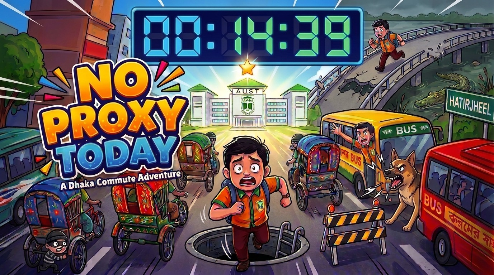
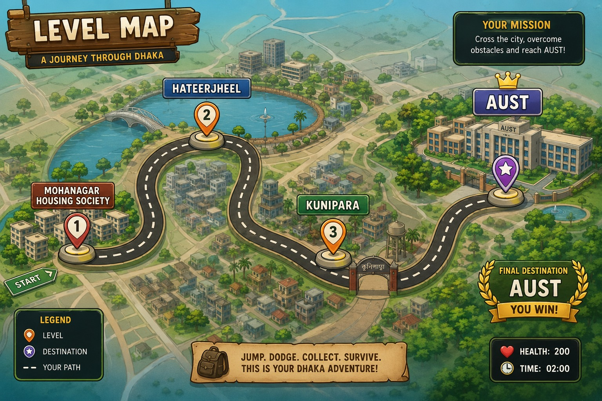

# No Proxy Today

### A Dhaka Commute Adventure

**No Proxy Today** is a single-player 2D action-adventure game developed in **C++ using the iGraphics library**. It turns an AUST student's journey to campus into an adventure through Dhaka: dodge traffic, cross Hatirjheel, battle enemies, and make your way to the university.

Created for **CSE-1200: Software Development I** at **Ahsanullah University of Science and Technology (AUST)**, the project demonstrates sprite animation, keyboard and mouse input, collision detection, audio playback, and file-based progress saving.

[Watch the Gameplay Demo](https://youtu.be/qaFt3v9Si9w?si=sWRcaKMLnWZz-U-C) | [GitHub Repository](https://github.com/saidul784/No-Proxy-Today)

## Features

- **Three playable levels** set along a Dhaka commute.
- **Varied gameplay:** automatic running, obstacle dodging, river combat, pirate-ship battles, and street encounters.
- **Animated characters** with running, jumping, walking, and throwing actions.
- **Health and score displays**, with a countdown timer in Level 1.
- **Collectible coins and power-ups**, including medikits and shields in Level 1.
- **Sound effects and music**, including traffic warnings, rain, enemy sounds, and voiced scenes.
- **Campaign map** showing level availability and completion status.
- **Saved campaign progress** across sessions.
- **Player-name entry and separate top-five leaderboards** for each level.
- **Pause, resume, restart, and mute controls.**

## Project Details

| Item | Details |
| --- | --- |
| Game | No Proxy Today — A Dhaka Commute Adventure |
| Language | C++ |
| Graphics | iGraphics, OpenGL, and GLUT |
| IDE / Toolset | Visual Studio 2013 / v120 |
| Build Platform | Win32 (32-bit) |
| Operating System | Windows PC |
| Genre | 2D action-adventure |
| Mode | Single-player |
| Course | CSE-1200: Software Development I |
| Institution | Ahsanullah University of Science and Technology |
| Team | A2_06 |

## Levels

### Level 1: Mohanagar to Hatirjheel

The character runs automatically while the street scrolls past. Time your jumps to avoid motorcycles, cars, dogs, rickshaws, and low-flying birds. High-flying birds can pass safely overhead, so watch their height before jumping.

- Start with **200 HP** and **one life**.
- Reach Hatirjheel within **120 seconds**.
- Collect coins worth **10 points each**.
- Pick up medikits to restore **50 HP**, up to the 200 HP maximum.
- Collect a shield to absorb the next **two obstacle hits**.
- Listen for warning sounds as obstacles approach.

### Level 2: Hatirjheel River and Pirate Ship

Begin with **700 HP** and travel by boat through the rain. Fight crocodiles using Chidori projectiles, then board a pirate ship for the next part of the journey.

On the ship, move and jump to collect Chidori, defeat the dakat enemies, and obtain the power-up needed to fight the Dakat Leader. Defeat the boss to complete the level.

### Level 3: Kunipara to AUST

Begin with **800 HP** and continue through a series of street encounters: a michil, a ragging conversation, a harassment encounter, a thief, and a final traffic jam.

Use collected rocks or sticks where required, follow the on-screen prompts, and cross the traffic jam while avoiding falling hazards. Reach the AUST gate to finish the journey.

## How to Run the Project

### Requirements

- Windows PC.
- **Visual Studio 2013** with C++ development support and the **v120** toolset.
- The included iGraphics headers, graphics libraries, and `GLUT32.DLL`.
- All supplied image, sprite, and audio folders.

### Setup

1. Extract the complete project ZIP, or clone the repository:

   ```bash
   git clone https://github.com/saidul784/No-Proxy-Today.git
   ```

2. Locate **`lab2.sln`** and open it in Visual Studio 2013.
   - In `updated_game.zip`, it is under `noyon/noyon/lab2/lab2/`.
   - In the GitHub repository, it is at the repository root.
3. Select **Debug** and **Win32** as the build configuration and platform.
4. Choose **Build → Build Solution** (`Ctrl + Shift + B`).
5. Choose **Debug → Start Without Debugging** (`Ctrl + F5`).

Keep the original folder names and layout intact. The game locates its images and audio relative to the working directory. Names such as `backround images` and `game_assetes` are intentional paths in the project.

If Windows reports that `GLUT32.DLL` is missing, copy the included DLL from the project folder into the folder containing the generated `lab2.exe`, then run again.

> This README describes the updated ZIP version. For all three levels and the features listed here, use that version or ensure the repository contains the same updated source and assets.

## How to Play

Open the campaign map from the main menu, click an available level, enter your player name, and press **Enter** to begin. Follow the prompts shown during each stage.

### Gameplay Controls

| Level / Context | Key | Action |
| --- | --- | --- |
| Level 1 | `Space` / `W` / `↑` | Jump; forward running is automatic |
| Level 2 — River | `Space` / `W` / `↑` | Throw Chidori during combat |
| Level 2 — Pirate ship | `A` / `←` | Move left |
| Level 2 — Pirate ship | `D` / `→` | Move right |
| Level 2 — Pirate ship | `W` / `↑` | Jump |
| Level 2 — Pirate ship | `Space` | Throw collected Chidori / powered Chidori |
| Level 3 | `Space` / `W` / `↑` | Jump when gameplay controls are active |
| Level 3 | `F` | Throw the collected rock or stick; hold to repeat |
| Level 3 — Thief encounter | `H` | Slap the thief when prompted |
| Level 3 — Traffic jam | `A` / `←`, `D` / `→` | Move left or right; move right to advance |
| All levels | `P` | Pause / resume |
| All levels | `R` | Restart the current level |
| Anywhere | `M` | Mute / unmute audio |
| Level 1 | `Esc` | Return to the main menu |
| Levels 2 and 3 | `Esc` | Return to the campaign map |

### Menu Controls

| Key / Input | Action |
| --- | --- |
| Mouse | Click menu buttons or campaign-map level markers |
| `W` / `S` | Change the selected main-menu option |
| `Enter` / `Space` | Activate the selected main-menu option |
| `Esc` | Go back; exits the game from the main menu |
| `←` / `→` or `A` / `D` | Switch level tabs on the leaderboard |

### Game Rules

- Avoid taking damage: reaching zero health ends the current attempt.
- In Level 1, running out of time also ends the attempt.
- Complete each level's required encounters to reach its finish.
- Collect coins to increase your score.
- Use power-ups and stage-specific attacks when available.
- Check the campaign map for completed and available levels.

## Saved Progress and High Scores

- **`info.txt`** stores campaign progress, completion flags, unlocks, and accumulated totals.
- **`highscores.txt`** stores the top five scores for each level, associated with player names.
- Both files are read from and written to the game's **working directory**. Launching from Visual Studio and launching an executable directly may use different working directories.
- The supplied ZIP contains existing save data, so some levels may already appear completed or unlocked.

## Project Contributors

**Team A2_06**

1. MD Shahidul Islam Noyon
2. Ali Muntakim
3. Abu Nahian Rifat

## Project Artwork

### Game Poster



### Campaign Map



## Gameplay Video

[Watch No Proxy Today on YouTube](https://youtu.be/qaFt3v9Si9w?si=sWRcaKMLnWZz-U-C)

## Acknowledgments

- **iGraphics:** S. M. Shahriar Nirjon, with modifications by Mohammad Imrul Jubair.
- **AUST Department of CSE**, for the CSE-1200 Software Development I course.
